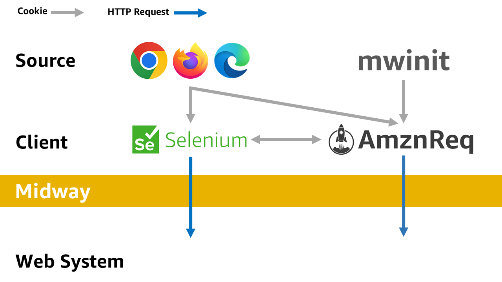

========
AmznReq
========

**AmznReq** is a Python library designed to facilitate secure communication with Amazon's internal web applications. It combines Kerberos authentication with session-based cookie management through Midway authentication, enabling easy HTTP requests to internal web applications using Python. This module simplifies the access process to web pages and APIs requiring Midway authentication, exports authentication information for Selenium, and easily imports authentication information from Selenium or web browsers like mwinit, supporting HTTP communication to internal web applications through a variety of means.

* **Repository**: `https://gitlab.aws.dev/mikohei/amzn_req`
* **GitLab Wiki**: `https://w.amazon.com/bin/view/AWS/Teams/WWPS/TSD/GitLab/`

Features
========

* **Secure HTTP Requests Execution**: Achieves secure communication using Kerberos authentication.
* **Cookie Management**: Supports importing cookies from mwinit, browsers (Chrome, Firefox, Edge), or Selenium WebDriver, and provides the capability to export session cookies for use in other sessions or applications.
* **Simplification of the Authentication Process**: Utilizes cookies exported from browsers or obtained from Selenium WebDriver to simplify the access process to web pages and APIs requiring authentication.
* **Verification and Initialization of Midway Authentication**: Includes functionality for verifying Midway authentication status and initializing the authentication state.

Differences from amzn_requests
------------------------------

While amzn_requests facilitated HTTP communication with internal web apps and APIs through simple functions, it had limitations in extensibility due to not maintaining sessions, requiring extensive coding outside the functions for more complex HTTP communications. Additionally, it recognized the need for methods of Midway authentication beyond mwinit, and for uses involving Selenium (or execution of JavaScript). To address these issues and demands, amzn_requests was evolved into a class with extended functionalities.

Installation
============

AmznReq can be installed with the following command:

.. code-block:: shell

   python setup.py install

Requirements
------------

* OS
  * Windows 11 (recommended)
  * **Operation on other OS has not been verified**
* Python 3.7 or higher
* requests
* requests_kerberos
* beautifulsoup4
* browser_cookie3

.. list-table::
   :widths: 100 100 100 100 100
   :header-rows: 1

   * - Platform
     - mwinit
     - chrome
     - firefox
     - edge
   * - Windows
     - OK
     - OK
     - OK
     - OK
   * - Mac
     - ?
     - ?
     - ?
     - ?
   * - Linux
     - ?
     - ?
     - ?
     - ?

Pre-authenticating with Midway
==============================

Please authenticate with Midway before using AmznReq. Without pre-authentication, you may receive a response with JSON or a status code other than 200 as shown below:

.. code-block:: json

   {
      "status": "error",
      "message": "Unauthenticated",
      "desc": "You should authenticate (may use mwinit)",
      "step_up_methods": [
         {
            "cap_name": "Midway Authentication",
            "cap_guid": "com.amazon.aea.midway.LDAPSuccess",
            "cap_url": "https://midway-auth.amazon.com/login?reauth=1",
            "cap_display_string": "Please login with Midway."
         }
      ]
   }

There are mainly two methods for Midway authentication:

mwinit
------

If you are using Windows, please obtain `mwinit` from the Software Center. Then, execute the following command in the command prompt or PowerShell:

.. code-block:: shell

   mwinit -o

After executing the command, enter your PIN and touch the security key to ensure the authentication is successfully completed.

Web Browser
-----------

Please authenticate with Midway using your web browser. AmznReq supports importing authentication information from the following web browsers:

* Chrome
* Firefox
* Microsoft Edge

Usage
=====

Sending HTTP Requests
---------------------

.. code-block:: python

   import os

   from amzn_req import AmznReq

   alias = os.getlogin()
   url = f"https://phonetool.amazon.com/users/{alias}.json"

   ar = AmznReq()
   res = ar.requests(url)

   print(res.text)
   print(res.status_code)

Importing cookies
-----------------

.. code-block:: python

   # Chrome
   ar.set_chrome_cookie()

   # Firefox
   ar.set_firefox_cookie()

   # Microsoft Edge
   ar.set_edge_cookie()

   # mwinit
   ar.set_mwinit_cookie()

   # Selenium
   selenium_cookies = driver.get_cookies()
   ar.import_cookies_from_selenium(selenium_cookies)

Exporting Cookies
-----------------

.. code-block:: python

   # CookieJar
   cookie_jar = ar.export_cookies()

   # Selenium
   selenium_cookies = ar.export_cookies_for_selenium()
   driver.get("https://midway-auth.amazon.com/")
   for cookie in selenium_cookies:
       driver.add_cookie(cookie)

Verifying if Authenticated with Midway
--------------------------------------

.. code-block:: python

   if ar.is_midway_authenticated():
       print("Session is authenticated with Midway.")
   else:
       print("Attempting to authenticate with Midway.")
       amzn_req.exec_mwinit() # Execute mwinit

Closing a session
-----------------

.. code-block:: python

   ar.close()

Starting a new session
----------------------

.. code-block:: python

   ar.new_session()

Refreshing the session without closing it
-----------------------------------------

.. code-block:: python

   ar.refresh_session()

References
==========

* `amzn_requests <https://w.amazon.com/bin/view/Users/mikohei/python/amzn_requests/>`_
* `NextGenMidway UserGuide <https://w.amazon.com/bin/view/NextGenMidway/UserGuide/#Python>`_
